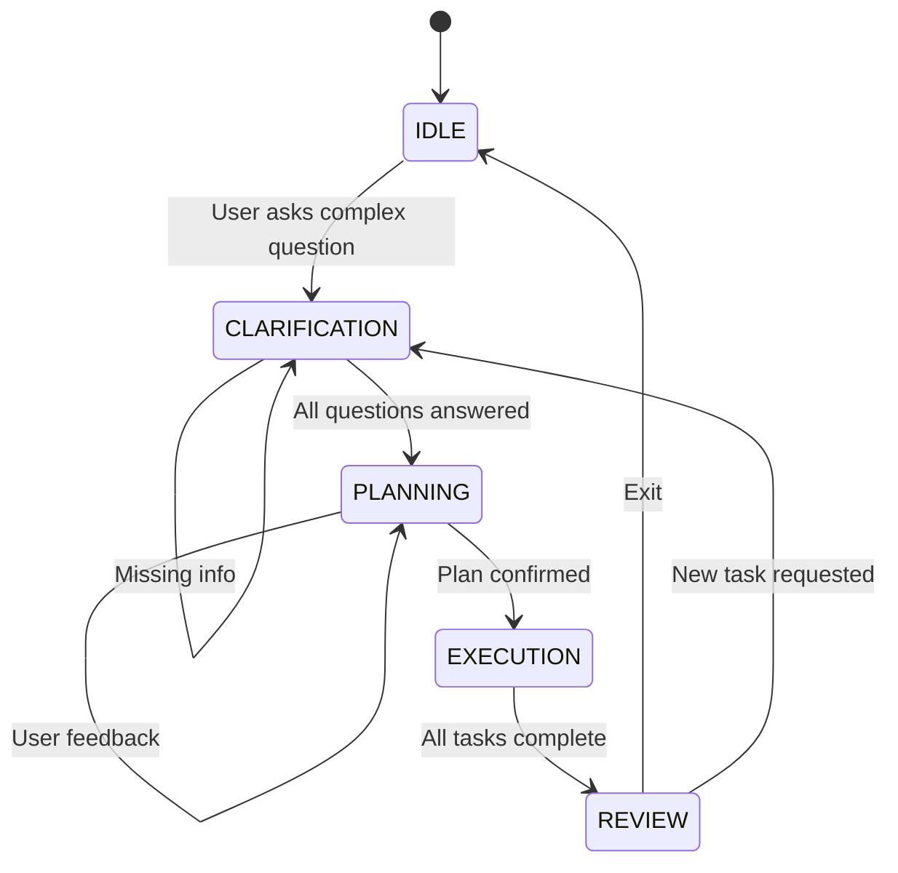
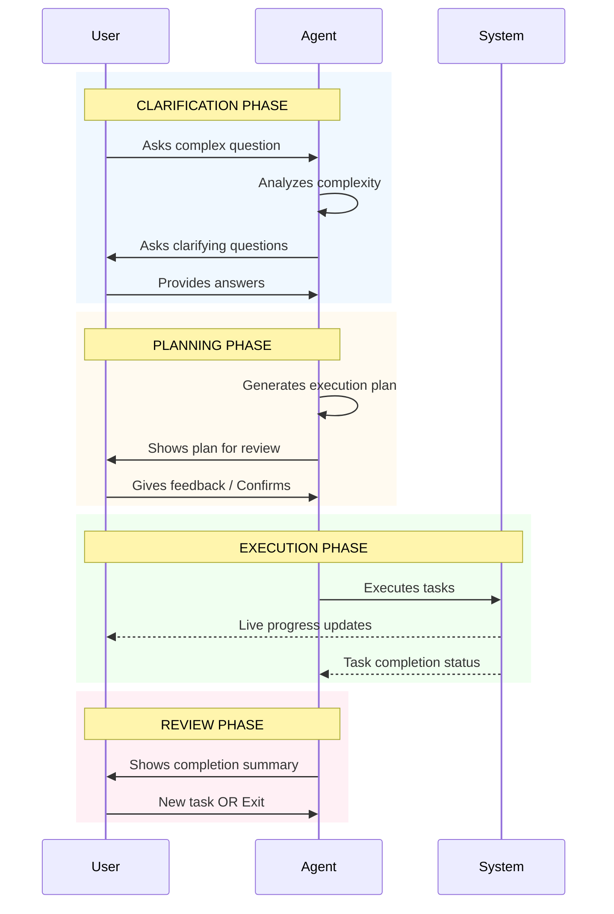
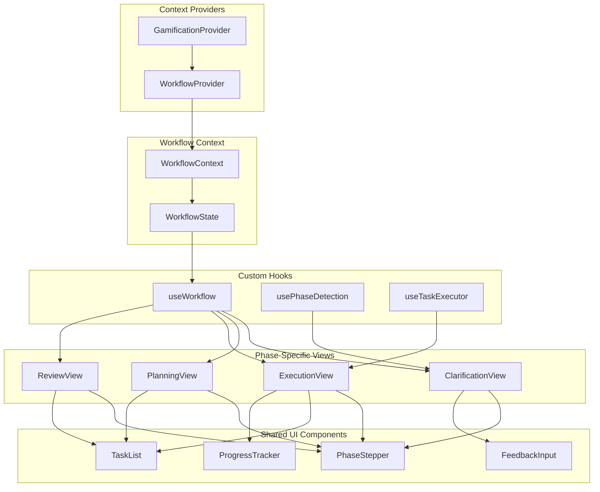
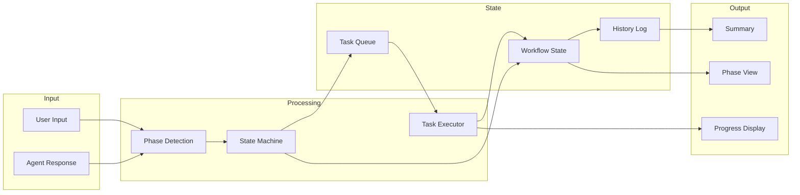
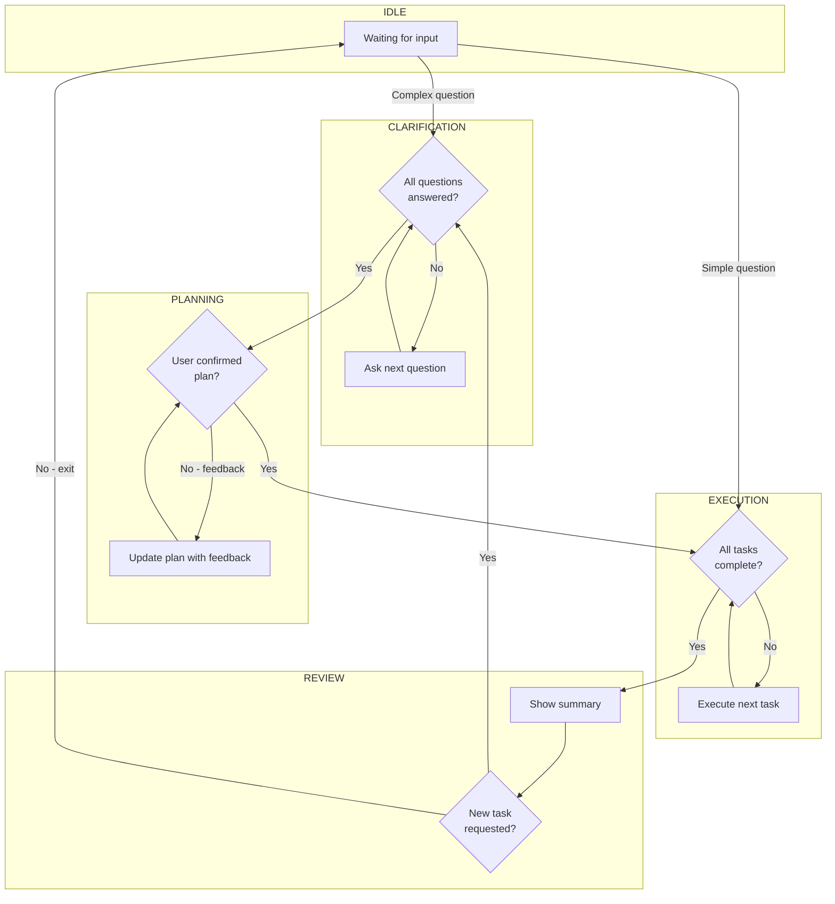

# Workflow Architecture Visualization

This document contains Mermaid diagrams visualizing the Agent Conversation Workflow architecture. These diagrams can be viewed directly on GitHub, copied into Notion/Confluence, or exported as images for presentations.

---

## 1. Main State Machine Flow

This diagram shows the 5 phases of the conversation workflow with transition conditions and loop-backs.

### Phase Descriptions

| Phase | Description | Entry Condition | Exit Condition |
|-------|-------------|-----------------|----------------|
| **IDLE** | Initial state, waiting for user input | System start or workflow reset | User submits complex question |
| **CLARIFICATION** | Agent asks questions to understand requirements | Complex question detected | All necessary information gathered |
| **PLANNING** | Agent creates execution plan for user review | Clarification complete | User confirms the plan |
| **EXECUTION** | Agent executes tasks with live progress | Plan confirmed | All tasks complete |
| **REVIEW** | Summary and next steps | Execution complete | User exits or starts new task |

---

## 2. User-Agent Interaction Sequence

This sequence diagram shows the back-and-forth communication between User and Agent through each workflow phase.

### Interaction Patterns

- **Clarification**: Iterative Q&A until requirements are clear
- **Planning**: Collaborative plan refinement with user feedback
- **Execution**: Real-time visibility into task progress
- **Review**: Summary presentation and decision point

---

## 3. Component Architecture

This diagram shows how the React components, context providers, and hooks connect together.

### Component Responsibilities

| Component | Responsibility |
|-----------|----------------|
| **WorkflowProvider** | Manages global workflow state and phase transitions |
| **WorkflowContext** | Provides state and actions to child components |
| **useWorkflow** | Hook for accessing workflow state and actions |
| **usePhaseDetection** | Automatically detects when phase transitions should occur |
| **useTaskExecutor** | Handles task execution with progress tracking |
| **PhaseStepper** | Visual indicator of current workflow phase |
| **TaskList** | Displays tasks with status and progress |
| **ProgressTracker** | Shows real-time execution progress |
| **FeedbackInput** | Captures user feedback during clarification/planning |

---

## 4. Data Flow Diagram

This diagram shows how data flows through the system during a workflow session.

---

## 5. Phase Transition Rules

This diagram details the specific conditions that trigger phase transitions.

---

## Usage Instructions

### Viewing on GitHub
Simply navigate to this file on GitHub - Mermaid diagrams render automatically.

### Exporting as Images
1. Use [Mermaid Live Editor](https://mermaid.live/) - paste diagram code and export
2. Use VS Code with Mermaid extension for local rendering
3. Use browser dev tools to screenshot rendered diagrams on GitHub

### Copying to Notion/Confluence
- **Notion**: Use `/code` block and select Mermaid language
- **Confluence**: Use Mermaid macro or code block with Mermaid support

### Presentation Tools
- Export as PNG/SVG from Mermaid Live Editor
- Embed in Google Slides, PowerPoint, or Keynote
